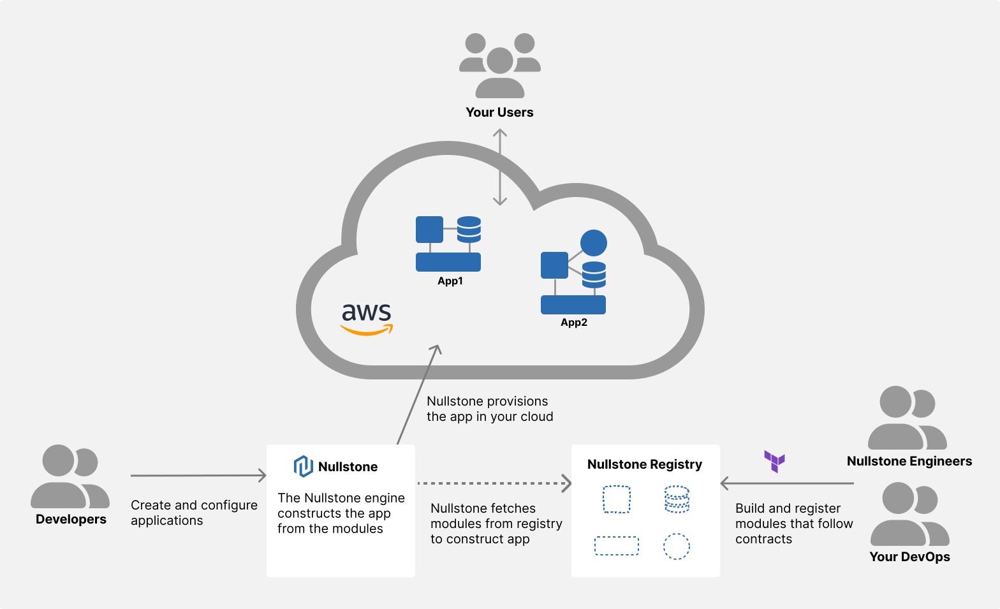

# Nullstone

Nullstone is a Heroku-like developer platform launched on your cloud accounts.
We offer a simple developer experience for teams that want to use Infrastructure-as-code tools like Terraform.

This repository contains code for the Nullstone CLI which is used to manage Nullstone from the command line.
This includes creating and deploying app, domains, and datastore as well as creating and managing Terraform workspaces.

## How to Install

### Homebrew (Mac)

```shell
brew tap nullstone-io/nullstone https://github.com/nullstone-io/nullstone.git
brew install nullstone
```

### Snap (Linux)

[](https://snapcraft.io/nullstone)

### Scoop (Windows)

```shell
scoop bucket add nullstone https://github.com/nullstone-io/nullstone.git
scoop install nullstone
```

## Documentation

For a complete set of Nullstone documentation, visit [docs.nullstone.io](https://docs.nullstone.io). Check out the links below for specific topics within the docs.

- [CLI Docs](https://docs.nullstone.io/getting-started/cli/docs.html) - 
Learn more about the Nullstone CLI; including how to install and use it.

## Community & Support

- [Public Roadmap](https://github.com/orgs/nullstone-io/projects/1/views/1) - View upcoming features.
- [Discussions](https://github.com/nullstone-io/nullstone/discussions) - View product updates.
- [GitHub Issues](https://github.com/nullstone-io/nullstone/issues) - Request new features, report bugs and errors you encounter.
- [Slack](https://join.slack.com/t/nullstone-community/signup) - Ask questions, get support, and hang out.
- Email Support - support@nullstone.io

## Resources

- [CircleCI Orb](https://github.com/nullstone-io/nullstone-orb)
- GitHub Action (In Development)
- [Go API Client](https://github.com/nullstone-io/go-api-client)
- [Nullstone Modules](https://github.com/nullstone-modules)

## How it works

The Nullstone platform operates similar to a developer platform that is internally built and used at large tech companies.
It consists of a UI, API, and CLI to serve both software engineers and platform engineers.
Software engineers use official Nullstone modules combined with modules built by their own platform engineers to launch and configure their application.
Platform engineers utilize the Nullstone platform to codify and administer infrastructure architectures for their teams without worrying about building user interfaces.


